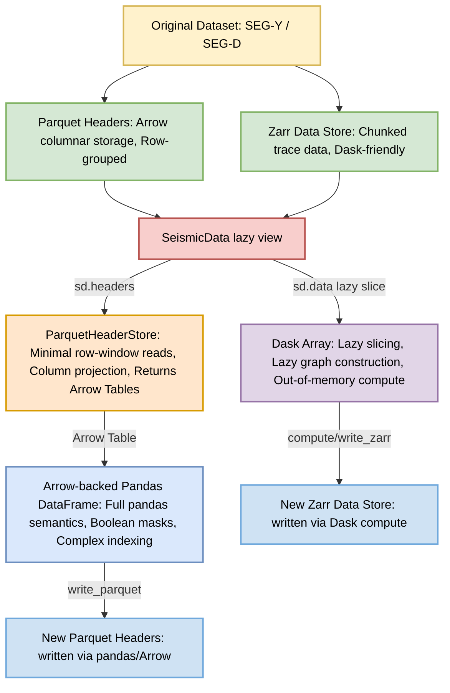

# SeismicData Architecture

This document explains the architecture of PySeis's core `SeismicData` model, which provides lazy, out-of-core access to seismic datasets.

## Overview

The `SeismicData` architecture separates concerns between:
- **Storage**: Parquet (headers) and Zarr (trace data)
- **Lazy Access**: Dask arrays and windowed Parquet reads
- **In-Memory Header Processing**: Arrow-backed Pandas DataFrames

This design enables efficient handling of TB-scale datasets that exceed available RAM.

## Architecture Diagram



## Key Components

### 1. Storage Layer

#### Parquet Headers
- **Format**: Arrow columnar storage with row groups
- **Purpose**: Efficient storage and retrieval of trace metadata
- **Benefits**:
  - Column projection (read only needed fields)
  - Row-group based slicing (minimal I/O)
  - Compression

#### Zarr Data Store
- **Format**: Chunked N-dimensional arrays
- **Purpose**: Store trace sample data
- **Benefits**:
  - Dask-friendly chunking
  - Parallel I/O
  - Cloud-ready (works on S3/GCS)

### 2. Lazy Access Layer

#### SeismicData
- **Role**: Lazy container managing views over data and headers
- **Key Features**:
  - Slicing creates new views without loading data
  - Internal `_trace_slice` tracks current window
  - Copy-on-write semantics

#### ParquetHeaderStore
- **Role**: Minimal window reader for Parquet files
- **API**: `read_window(start, stop, columns=None)` → Arrow Table
- **Limitation**: No fancy indexing (handled by Pandas layer)

### 3. In-Memory Processing Layer

#### Arrow-backed Pandas DataFrame
- **Created**: When `sd.headers` is accessed
- **Benefits**:
  - Full Pandas API (boolean masks, fancy indexing, etc.)
  - Zero-copy from Arrow when possible
  - Efficient memory usage

#### Dask Array
- **Created**: Wraps Zarr store
- **Benefits**:
  - Lazy slicing and computation
  - Out-of-memory algorithms
  - Parallel execution

## Usage Example

```python
import dask.array as da
from pyseis_io.models import SeismicData, ParquetHeaderStore

# Open a dataset (lazy)
data = da.from_zarr('path/to/traces.zarr')
header_store = ParquetHeaderStore('path/to/headers.parquet')
sd = SeismicData(data, header_store, sample_rate=2000.0)

# Slice (still lazy)
subset = sd[1000:2000]

# Access headers (triggers read of rows 1000-2000)
headers = subset.headers  # Returns Pandas DataFrame

# Filter using Pandas
cdp_subset = headers[headers['cdp'] > 5000]

# Access data (lazy Dask array)
trace_data = subset.data  # Still lazy

# Compute (triggers actual loading)
data_np, headers_pd = subset.compute()
```

## Design Rationale

### Why Parquet for Headers?
- Columnar format enables reading only needed fields
- Row groups allow efficient range queries
- Arrow integration provides zero-copy to Pandas
- Industry standard with broad tooling support

### Why Zarr for Data?
- Native chunking matches seismic processing patterns
- Dask integration is seamless
- Cloud-native (unlike HDF5)
- Parallel writes without locking

### Why Not Dask DataFrame for Headers?
- `dd.DataFrame.iloc` is incomplete and slow
- Partition boundaries make alignment unpredictable
- Headers are typically small enough for in-memory processing
- Pandas provides richer indexing semantics

### Separation of Concerns
- **Parquet/Arrow**: Efficient disk I/O
- **Pandas**: Rich in-memory indexing API
- **Dask**: Out-of-core computation
- **SeismicData**: Lazy view management
